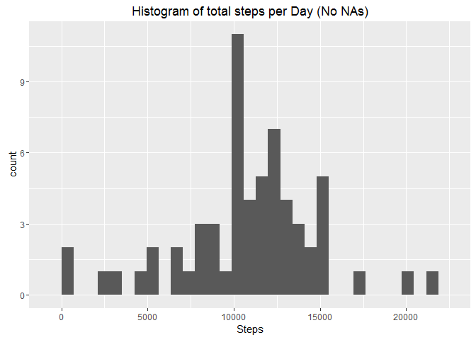

# Reproducible Research: Peer Assessment 1


## Loading and preprocessing the data

The activity data (included in the repository) that are described in the README.md file are loaded. Needed librarys are loaded as well. 


```r
activity <- read.csv("activity.csv")

library(dplyr)
library(ggplot2)
```

## What is mean total number of steps taken per day?

In this section, the histogram of the steps per day is shown. Missing values are ignored.


```r
##create proper data fram with sums per day
activityPerDay <- summarise(group_by(activity, date), 
                            steps = sum(steps, na.rm = TRUE))
##calculate needed aggregates
rapdMedian <- median(activityPerDay$steps)
rapdMean <- round(mean(activityPerDay$steps), 1)
##plot the histogram
qplot(activityPerDay$steps, main = "Histogram of total steps per Day", 
      xlab = "Steps")
```

 

Based on the above calculations, 9354.2 is the mean and 10395 is the median of the steps taken per day.

## What is the average daily activity pattern?

In this section, the below plot gives the pattern of the average daily activity. Missing values are ignored.


```r
##create proper data frame with means per interval
activityPerInterval <- summarise(group_by(activity, interval), 
                                 steps = round(mean(steps, na.rm = TRUE),1))
##calc interval with highest activity
rmaxSteps <- max(activityPerInterval$steps)
rmaxInterval <- activityPerInterval[activityPerInterval$steps == rmaxSteps 
                            ,"interval"][[1]]
##plot pattern
with(activityPerInterval, qplot(interval, steps, geom = "line", 
                                main = "Average Daily Activity"))
```

 

The highest mean of steps (206.2) through all the days found during the 835 interval. 

## Imputing missing values


```r
##count and percentage of NAs
rCntNAs <- sum(is.na(activity$steps))
rNAsPcg <- round(rCntNAs * 100 / nrow(activity),2)
```

2304 intervals have no steps value. This relatively high percentage (13.11%) can distort the results of the research.  
In order to mitigate that issue, we assigned calculated values to the missing ones, based on the rest of the data.  
The assumption is that the missing value should be close to the mean of the steps for the same interval of the same weekday. So this value is calculated and assigned to the dataset. As a result, the histogram and the mean values of the first question are answered again, after imputing the missing values.   


```r
##temporary data frame used in the next command
activityPerWDandInterval <- summarise(group_by(activity, 
                        WeekDay = as.POSIXlt(activity$date)$wday + 1, interval), 
                        stepsAVG = round(mean(steps, na.rm = TRUE),1))

##creation of the new data frame that contains no NAs, replacement of the activity one
activityNoNAs <- activity %>% 
            mutate(WeekDay = as.POSIXlt(activity$date)$wday + 1) %>% 
            inner_join(activityPerWDandInterval, by = c("interval", "WeekDay")) %>%
            mutate(steps = ifelse(is.na(steps), stepsAVG, steps)) %>%
            select(1:3)

##data frame for the histogram and for calculation of the mean values
activityPerDayNoNAs <- summarise(group_by(activityNoNAs, date), 
                            steps = sum(steps, na.rm = TRUE))

rapdMedianNoNAs <- median(activityPerDayNoNAs$steps)
rapdMeanNoNAs <- round(mean(activityPerDayNoNAs$steps),1)

qplot(activityPerDayNoNAs$steps, main = "Histogram of total steps per Day (No NAs)", 
      xlab = "Steps")
```

 

The comparison of the previous two histograms and the mean (10821.2 without NAs while 9354.2 with NAs) and the median (11015 without NAs while 10395 with NAs) shows that there is a significant difference. In fact, imputing the missign values using the described algorithm lead to increasing of the calculated totals. 

## Are there differences in activity patterns between weekdays and weekends?

The below plot is provided in order this query to be answered.


```r
##calculate proper data frame
activityPerWeekDayOrNot <- activityNoNAs %>%
            mutate(WeekDayOrNot = ifelse((as.POSIXlt(activityNoNAs$date)$wday + 1) 
                                         %in% c(1,7), "weekend", "weekday")) %>%
            group_by(WeekDayOrNot, interval) %>%
            summarise(steps = round(mean(steps),1))

##draw the plot
with(activityPerWeekDayOrNot, qplot(interval, steps, facets = WeekDayOrNot ~ ., 
                geom = "line", main = "Comparison of Activity Patterns"))
```

 

During the weekdays the activity is higher early in the morning and then falls. On the other hand, in the weekends the activity is better balanced during the day. 
